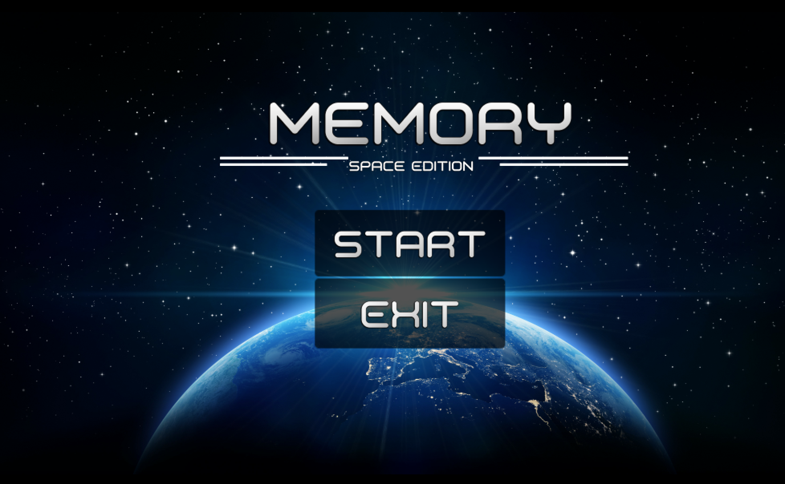
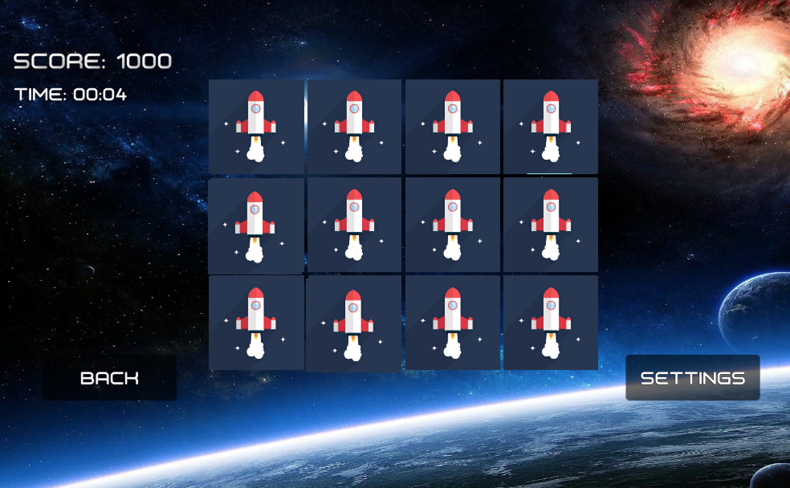
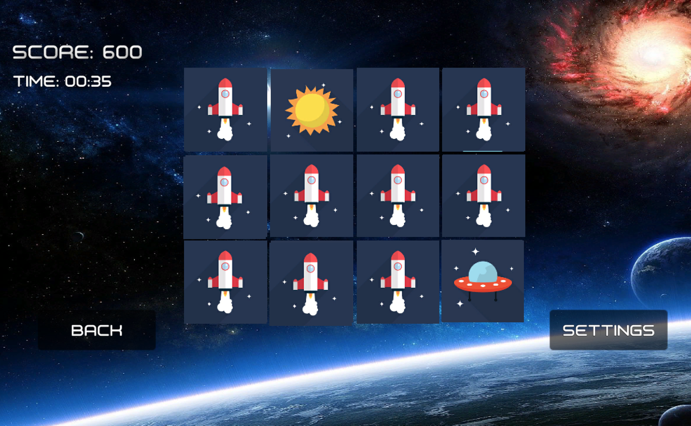
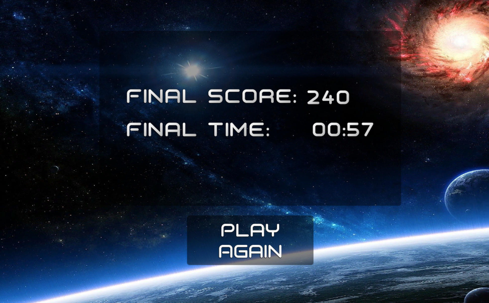

# Memory-Game-Unity
This space-themed flash card game was built with Unity and C#.  Correctly match all pairs of cards to win!
Choose to match either 6, 7, 8, 9, or 10 unique pairs of cards!

MainMenu

The Play Scene.

Here the player has incorrectly selected a pair of cards

The player has successfully selected all matching cards
